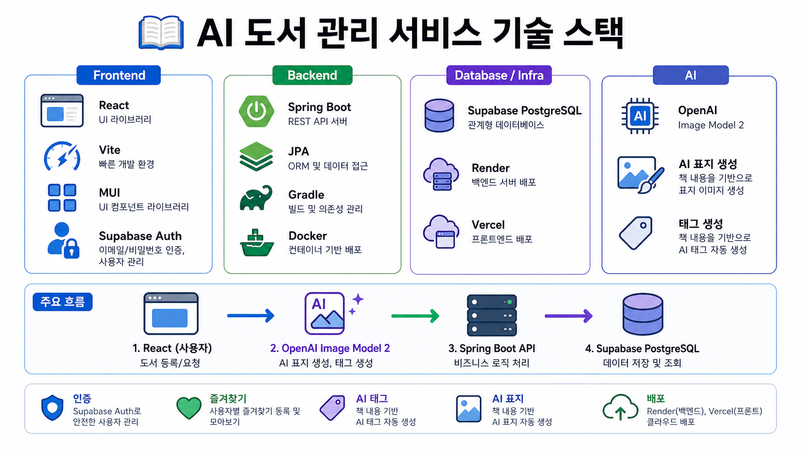
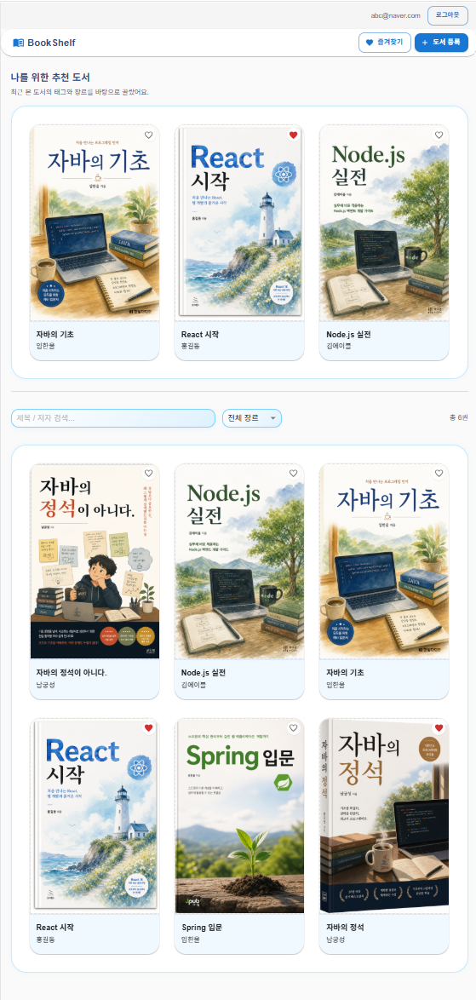
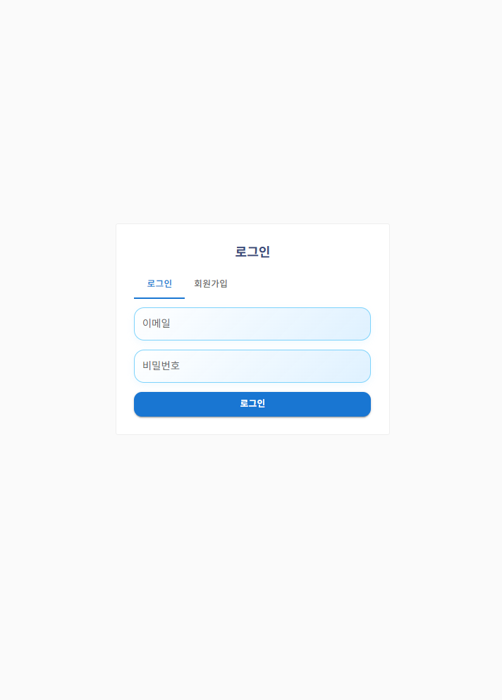
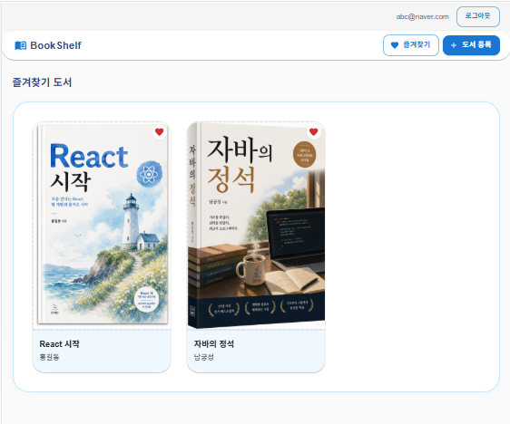
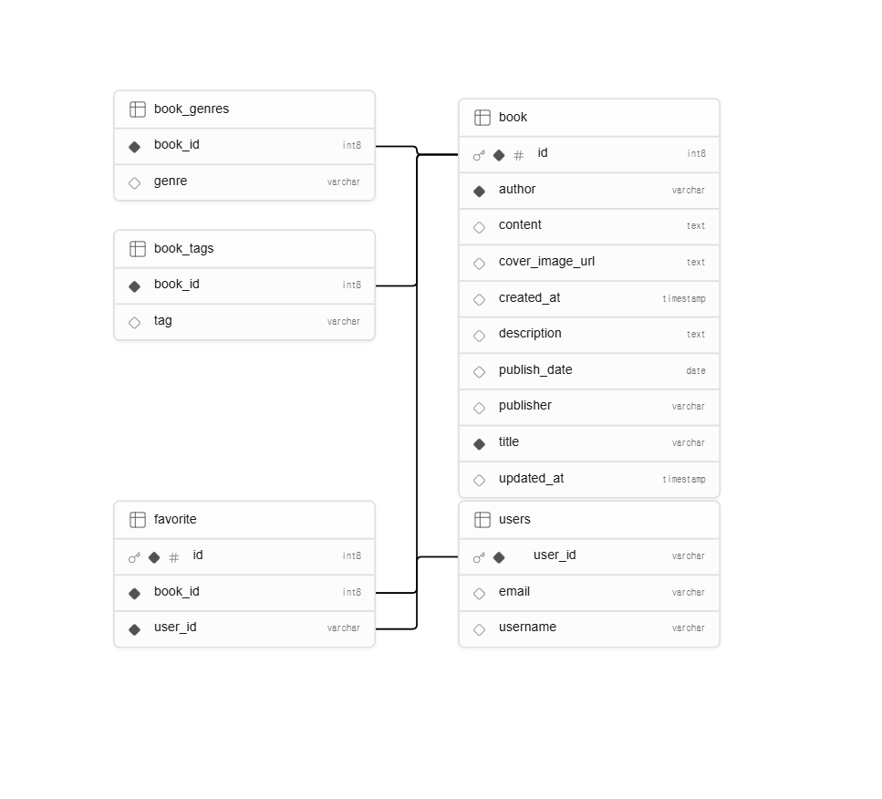

# AI 미니프로젝트 5차 - 도서 관리 서비스

## 개요

도서 정보를 등록, 조회, 수정, 삭제할 수 있는 웹 서비스입니다.

기존 도서 관리 기능에 Supabase 기반 로그인, AI 표지 생성, 즐겨찾기 기능을 연결하여 사용자별 도서 관리 경험을 확장했습니다.

주요 목표는 React 프론트엔드와 Spring Boot 백엔드를 API로 연동하고, 예외 처리와 배포 환경까지 포함한 전체 흐름을 구현하는 것입니다.

## 기술스택

| 구분 | 기술 |
|---|---|
| Frontend | React, Vite, MUI, Supabase JS |
| Backend | Java 17, Spring Boot, Spring Data JPA |
| Database | Supabase PostgreSQL |
| Auth | Supabase Auth |
| AI | OpenAI Image API |
| Deploy | Vercel, Render |
| Tool | GitHub, Postman |



## 프로젝트 구조

```text
mini-project/
├── Backend/    Spring Boot API 서버
├── Frontend/   React + Vite 클라이언트
└── README.md
```

## 실행방법

### Backend 실행

```bash
cd Backend
./gradlew bootRun
```

Backend 기본 주소:

```text
http://localhost:8080
```

Backend 환경변수 예시:

```env
SPRING_PROFILES_ACTIVE=supabase
SUPABASE_DB_URL=jdbc:postgresql://...
SUPABASE_DB_USER=...
SUPABASE_DB_PASSWORD=...
APP_CORS_ALLOWED_ORIGINS=http://localhost:5173
```

### Frontend 실행

```bash
cd Frontend
npm install
npm run dev
```

Frontend 기본 주소:

```text
http://localhost:5173
```

Frontend 환경변수 예시:

```env
VITE_SUPABASE_URL=...
VITE_SUPABASE_ANON_KEY=...
VITE_API_BASE_URL=http://localhost:8080/books
```

## API 명세

### 도서 API

| 기능 | Method | URL | 설명 |
|---|---|---|---|
| 도서 전체 조회 | GET | `/books` | 등록된 도서 목록 조회 |
| 도서 상세 조회 | GET | `/books/{id}` | 특정 도서 상세 조회 |
| 도서 등록 | POST | `/books` | 새 도서 등록 |
| 도서 수정 | PATCH | `/books/{id}` | 도서 정보 수정 |
| 도서 삭제 | DELETE | `/books/{id}` | 도서 삭제 |
| 도서 수 조회 | GET | `/books/count` | 전체 도서 개수 조회 |
| 제목 검색 | GET | `/books/search/title?title={title}` | 제목 기준 검색 |
| 저자 검색 | GET | `/books/search/author?author={author}` | 저자 기준 검색 |
| 상세 검색 | GET | `/books/search/detail` | 조건 기반 상세 검색 |
| 페이지 조회 | GET | `/books/page` | 페이지 단위 도서 조회 |

도서 등록 요청 예시:

```json
{
  "title": "자바의 정석",
  "author": "남궁성",
  "publisher": "도우출판",
  "publishDate": "2024-01-01",
  "genres": ["프로그래밍"],
  "description": "자바 기본서를 소개합니다.",
  "content": "도서 상세 내용",
  "tags": ["Java", "Backend"]
}
```

### AI 표지 API

| 기능 | Method | URL | 설명 |
|---|---|---|---|
| 표지 이미지 저장 | PATCH | `/books/{id}/cover` | AI로 생성한 표지 Data URL 저장 |

요청 예시:

```json
{
  "coverImageUrl": "data:image/png;base64,..."
}
```

### 즐겨찾기 API

| 기능 | Method | URL | 설명 |
|---|---|---|---|
| 즐겨찾기 ID 목록 조회 | GET | `/favorites/book-ids?userId={userId}` | 하트 표시용 도서 ID 목록 조회 |
| 즐겨찾기 도서 목록 조회 | GET | `/favorites?userId={userId}` | 즐겨찾기 모아보기 페이지용 |
| 즐겨찾기 추가 | POST | `/books/{bookId}/favorites` | 특정 도서를 즐겨찾기에 추가 |
| 즐겨찾기 삭제 | DELETE | `/books/{bookId}/favorites?userId={userId}` | 특정 도서 즐겨찾기 해제 |

즐겨찾기 추가 요청 예시:

```json
{
  "userId": "Supabase Auth user.id"
}
```

## R&R

| 담당 | 역할 |
|---|---|
| Backend | 도서 CRUD API, 검색 API, 즐겨찾기 API, DB 연동 |
| Frontend | 도서 목록/상세/등록 화면, 로그인 UI, 즐겨찾기 UI |
| AI 연동 | OpenAI 이미지 생성 호출, 생성 이미지 Data URL 변환 |
| 통합/예외처리 | Frontend-Backend API 연결, CORS 설정, 검증 실패/404 처리, 배포 환경변수 정리 |
| 배포 | Frontend Vercel 배포, Backend Render 배포, Supabase DB/Auth 연결 |

## 주요 구현 결과

### 1. 도서 관리 기능

- 도서 전체 조회, 상세 조회, 등록, 수정, 삭제 기능을 구현했습니다.
- React 화면에서 Spring Boot API를 호출하도록 연결했습니다.
- 도서 제목, 저자, 출판사, 장르, 태그, 설명, 본문, 표지 URL을 관리할 수 있습니다.



### 2. AI 표지 생성 및 저장

- Frontend에서 OpenAI Image API를 호출해 도서 표지를 생성합니다.
- 응답받은 이미지를 Data URL 형식으로 변환합니다.
- 변환된 표지 이미지를 Backend의 `/books/{id}/cover` API로 저장합니다.
- 저장된 표지는 도서 상세 화면에서 확인할 수 있습니다.

### 3. Supabase 로그인

- Supabase Auth를 사용해 회원가입과 로그인을 구현했습니다.
- 로그인하지 않은 사용자는 인증 화면을 먼저 보게 됩니다.
- 로그인 성공 후 도서 목록, 상세, 즐겨찾기 기능을 이용할 수 있습니다.



### 4. 사용자별 즐겨찾기

- 책 카드와 상세 화면에 하트 버튼을 추가했습니다.
- 로그인한 사용자의 `user.id`를 기준으로 즐겨찾기를 저장합니다.
- 즐겨찾기한 도서는 모아보기 화면에서 따로 확인할 수 있습니다.



### 5. 배포 구성

- Frontend는 Vercel에 배포할 수 있도록 구성했습니다.
- Backend는 Render에 배포할 수 있도록 구성했습니다.
- Supabase PostgreSQL을 운영 DB로 사용합니다.
- 배포 환경에서는 API 주소, DB 접속 정보, CORS 허용 주소를 환경변수로 관리합니다.

## ERD

현재 DB 구조는 Supabase PostgreSQL 기준입니다.



```text
book
- id PK
- title
- author
- publisher
- publish_date
- description
- content
- cover_image_url
- created_at
- updated_at

book_genres
- book_id FK
- genre

book_tags
- book_id FK
- tag

users
- user_id PK
- email
- username

favorite
- id PK
- user_id FK
- book_id FK
```

`users.user_id`는 Supabase Auth에서 발급되는 `user.id` 문자열 UUID를 기준으로 저장합니다.

비밀번호는 프로젝트 DB에 직접 저장하지 않고, Supabase Auth에서 관리합니다.

## 트러블슈팅

### 1. Frontend에서 Backend API 호출 실패

증상:

```text
Failed to fetch
ERR_CONNECTION_REFUSED
```

원인:

Backend 서버가 실행되지 않았거나, `VITE_API_BASE_URL` 값이 실제 Backend 주소와 다릅니다.

해결:

Backend 실행 여부를 확인하고 Frontend `.env` 값을 수정합니다.

```env
VITE_API_BASE_URL=http://localhost:8080/books
```

### 2. CORS 오류

증상:

브라우저에서 API 호출이 차단됩니다.

원인:

Backend에서 Frontend 주소를 허용하지 않았습니다.

해결:

Backend 환경변수에 Frontend 주소를 추가합니다.

```env
APP_CORS_ALLOWED_ORIGINS=http://localhost:5173
```

### 3. Supabase 로그인 후 즐겨찾기 실패

증상:

즐겨찾기 API 호출 시 사용자를 찾지 못합니다.

원인:

Frontend는 Supabase Auth의 `user.id`를 보내고, Backend는 `users` 테이블의 `user_id`와 매칭합니다.

해결:

`users.user_id`는 Supabase Auth의 `user.id` 문자열 UUID 기준으로 저장합니다.

### 4. Render 배포 시 Java 실행 실패

증상:

```text
JAVA_HOME is not set
```

원인:

Render가 Monorepo 구조를 Node 프로젝트로 잘못 감지했습니다.

해결:

Backend 배포용 Dockerfile을 사용하여 Java 17 환경에서 Spring Boot 애플리케이션을 실행하도록 구성했습니다.

### 5. Supabase DB 연결 실패

증상:

Backend 시작 시 DB 연결 오류가 발생합니다.

원인:

DB URL, 사용자명, 비밀번호, Pooler 설정이 잘못되었거나 환경변수가 누락되었습니다.

해결:

Render 환경변수에 Supabase DB 접속 정보를 등록합니다. 비밀번호는 GitHub에 올리지 않고 배포 환경변수로만 관리합니다.

## 참고

README에 사용한 이미지는 `docs/images` 폴더에 정리했습니다.

- `docs/images/tech-stack.png`
- `docs/images/auth-screen.png`
- `docs/images/book-list.png`
- `docs/images/favorites-page.png`
- `docs/images/supabase-schema-erd.png`
- `docs/images/supabase-schema.svg`
